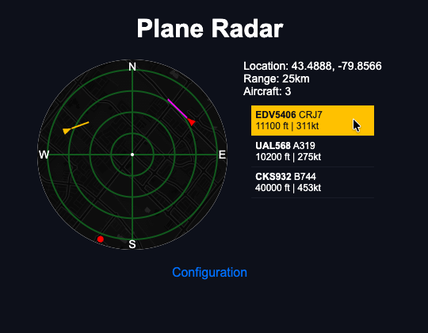
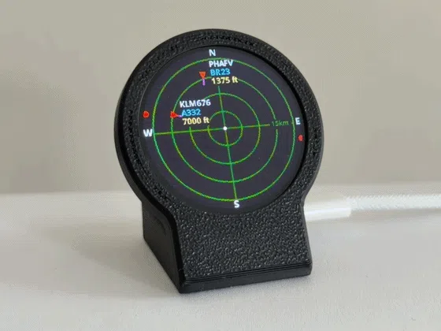

<a name="readme-top"></a>
<h1 align="center">Plane Radar 📡</h1>

<p align="center">A Python port of the <a href="https://github.com/MatixYo/ESP32-Plane-Radar">ESP32-C3 Plane Radar</a> designed to run on a Raspberry Pi — with live ADS-B aircraft tracking on a circular GC9A01 display and a Flask web interface.</p>

<div align="center">

[](./LICENSE)
[](https://github.com/nicolasluckie/Plane-Radar/actions/workflows/ci.yml)

</div>

<div align="center">

|Web Version _(this)_|ESP-C3 Version|
|:---:|:---:|
|||

</div>

> [!NOTE]
> If you use ESP32s, make sure you get **good-quality** ones with proper antennas. The ones I got from Amazon were not strong enough to work reliably over Wi-Fi—_that's why I created this version for Raspberry Pis._

---

## Features

- **Live ADS-B tracking** — fetches real-time aircraft data from the [adsb.fi](https://adsb.fi) public API
- **Circular radar display** — range rings, heading triangles, speed vectors, and callsign/type/altitude tags
- **Beyond-ring indicators** — shows traffic outside the current display range
- **Web radar view** — browser-based canvas radar with Leaflet.js map overlay (CartoDB Dark Matter)
- **Aircraft hover tooltips** — detailed info on hover; list-to-radar highlighting
- **Configurable range presets** — 5, 10, 15, or 25 km display radius
- **Server-side caching** — web clients never hit the upstream API directly
- **Mock data mode** — develop and test offline using `data-sample.json`
- **Auto-start via systemd** — runs on boot as a background service

---

## Tech Stack

| Layer | Technology |
|-------|-----------|
| Language | Python 3 |
| Display | PIL (Pillow), Linux framebuffer (`/dev/fb1`), GC9A01 SPI overlay |
| Web | Flask 3, Leaflet.js |
| Data | [adsb.fi](https://adsb.fi) public API |
| Config | `python-dotenv` |
| HTTP | `requests` |

---

## Hardware

| Component | Details |
|-----------|---------|
| (x1) Raspberry Pi | Any model with Wi-Fi and GPIO. Zero W recommended (~$25 at [PiShop.ca](https://www.pishop.ca/product/raspberry-pi-zero-w/)) |
| (x1) Micro USB Power Supply | 5V/2.5A recommended (~$15 on [Amazon.ca](https://a.co/d/0fqh64Wt)) |
| (x1) 1.28" Circular TFT Display | GC9A01 driver chip. Pack of 3 for ~$30 on [Amazon.ca](https://a.co/d/0iCXuygu) |
| (x7) Jumper Cables | Pack of 120 for ~$15 on [Amazon.ca](https://a.co/d/001mKe6u) |

**Total:** _~$56 CAD (incl. tax)_

### GPIO Pin Mapping

| Function | Pi GPIO | Display Pin |
|----------|---------|-------------|
| MOSI (Data) | GPIO 10 (MOSI) | DIN |
| SCLK (Clock) | GPIO 11 (SCLK) | CLK |
| CS (Chip Select) | GPIO 8 (CE0) | CS |
| DC (Data/Command) | GPIO 25 | DC |
| RST (Reset) | GPIO 24 | RES |
| VCC | 3.3V | VCC |
| GND | GND | GND |

---

## Getting Started

### Prerequisites

- Raspberry Pi running Raspberry Pi OS (Lite recommended)
- Python 3.9+
- SPI enabled via `raspi-config`
- GC9A01 kernel overlay loaded (see below)

### 1. Enable the GC9A01 Display Overlay

The display requires a kernel device tree overlay:

```bash
sudo nano /boot/config.txt
```

Add at the end:
```
dtoverlay=gc9a01
```

Reboot, then verify:
```bash
sudo reboot
ls /dev/fb*
# Should show fb0 (HDMI) and fb1 (GC9A01)
```

### 2. Install System Dependencies

```bash
sudo apt update
sudo apt install python3-pip python3-venv git python3-spidev fonts-noto

# Enable SPI
sudo raspi-config
# Navigate to: Interface Options → SPI → Enable
```

### 3. Install the Application

**Option A — Clone directly on Pi (recommended):**

```bash
git clone <repo-url> /opt/planeradar
cd /opt/planeradar
python3 -m venv venv
source venv/bin/activate
pip install -r requirements.txt
cp .env.example .env
nano .env
```

**Option B — Copy from Mac:**

```bash
rsync -av --progress /path/to/Plane-Radar/ pi@<pi-ip>:/opt/planeradar/ \
  --exclude venv --exclude __pycache__ --exclude .git

ssh pi@<pi-ip>
cd /opt/planeradar
python3 -m venv venv
source venv/bin/activate
pip install -r requirements.txt
cp .env.example .env
nano .env
```

### 4. Configure SSH Key (Mac → Pi)

```bash
ssh-keygen -t rsa -b 4096 -f ~/.ssh/pi-planeradar -C "pi-planeradar"
ssh-copy-id -i ~/.ssh/pi-planeradar.pub pi@<pi-ip-address>
```

### 5. Run

```bash
cd /opt/planeradar
source venv/bin/activate
python main.py

# Debug mode (verbose aircraft output)
PLANERADAR_DEBUG=1 python main.py

# Mock data mode (offline, uses data-sample.json)
PLANERADAR_MOCK_DATA=1 python main.py
```

---

## Systemd Service

Run at boot as a background service:

1. Create `/etc/systemd/system/planeradar.service`:

```ini
[Unit]
Description=Plane Radar
After=network.target

[Service]
Type=simple
User=pi
WorkingDirectory=/opt/planeradar
Environment="PATH=/opt/planeradar/venv/bin"
ExecStart=/opt/planeradar/venv/bin/python main.py
Restart=always

[Install]
WantedBy=multi-user.target
```

2. Enable and start:

```bash
sudo systemctl enable planeradar
sudo systemctl start planeradar
sudo systemctl status planeradar

# Follow logs
sudo journalctl -u planeradar -f
```

---

## Project Structure

```
Plane-Radar/
├── main.py                  # Entry point — orchestrates all subsystems
├── display/
│   └── driver.py            # GC9A01 framebuffer driver (RGB → RGB565)
├── radar/
│   ├── display.py           # Radar renderer — coordinate conversion, drawing
│   ├── range.py             # Range presets and distance calculations
│   └── theme.py             # Colors and display constants
├── services/
│   ├── adsb_client.py       # ADS-B API client and aircraft cache
│   └── location.py          # Location config singleton
├── web/
│   └── server.py            # Flask web server — radar view and /api/aircraft endpoint
├── data-sample.json         # Mock ADS-B data for offline development
├── requirements.txt
├── .env.example
└── README.md
```

---

## API Endpoints

| Method | Path | Description |
|--------|------|-------------|
| `GET` | `/` | Browser-based radar view |
| `GET` | `/api/aircraft` | Cached aircraft data as JSON |

### `/api/aircraft` Response

```json
{
  "aircraft": [
    {
      "lat": 43.5,
      "lon": -79.9,
      "nose_deg": 270,
      "track_deg": 268,
      "gs_knots": 320,
      "callsign": "ABC123",
      "type": "B737",
      "alt": "35000 ft"
    }
  ],
  "center_lat": 43.6777,
  "center_lon": -79.6248,
  "outer_km": 25,
  "range_label": "25km"
}
```

> Web clients read from the in-memory cache. No upstream API calls are made per request — rapid browser refreshes or multiple tabs will not spam adsb.fi.

---

## Environment Variables

| Variable | Description | Default |
|----------|-------------|---------|
| `PLANERADAR_LAT` | Radar center latitude | `43.6777` |
| `PLANERADAR_LON` | Radar center longitude | `-79.6248` |
| `PLANERADAR_FETCH_INTERVAL_MS` | ADS-B fetch interval (ms) | `3000` |
| `PLANERADAR_FETCH_RADIUS_KM` | API fetch radius (km) | `25` |
| `PLANERADAR_RANGE_INDEX` | Display range preset (0=5km, 1=10km, 2=15km, 3=25km) | `1` |
| `PLANERADAR_USE_MILES` | Distance units (0=km, 1=miles) | `0` |
| `PLANERADAR_SHOW_RUNWAYS` | Show runway overlay (0/1) | `1` |
| `PLANERADAR_WEB_HOST` | Web portal bind host | `0.0.0.0` |
| `PLANERADAR_WEB_PORT` | Web portal port | `8080` |
| `PLANERADAR_API_BASE` | ADS-B API base URL | `https://opendata.adsb.fi/api/v3/lat/` |
| `PLANERADAR_LOG_LEVEL` | Log verbosity (`debug`, `info`, `warning`, `error`, `critical`) | `warning` |
| `PLANERADAR_LOG_TO_DISK` | Write rotating log file in addition to stderr (0/1) | `0` |
| `PLANERADAR_LOG_PATH` | Log file path (used when `LOG_TO_DISK=1`) | `/var/log/plane-radar/app.log` |
| `PLANERADAR_DEBUG` | Override log level to `debug` (0/1) | `0` |
| `PLANERADAR_MOCK_DATA` | Use `data-sample.json` instead of live API (0/1) | `0` |

> To preview raw API data: `curl "https://opendata.adsb.fi/api/v3/lat/43.6777/lon/-79.6248/dist/15"`

> [!TIP]
> Save that response as `data-sample.json` in the project root and set `PLANERADAR_MOCK_DATA=1` for offline development.

---

## Differences from ESP32 Version

| ESP32 | Raspberry Pi |
|-------|--------------|
| C++/Arduino | Python |
| LovyanGFX | PIL + Linux framebuffer |
| WiFiManager | Flask web portal |
| Preferences (NVS) | Environment variables (`.env`) |
| Button input | Web configuration only |
| No web radar view | Full web radar with Leaflet.js map |
| Hardcoded location | Configurable via `.env` |
| Fixed fetch radius | Configurable via `.env` |

---

## Troubleshooting

| Problem | Fix |
|---------|-----|
| Display not working | Verify SPI is enabled (`sudo raspi-config`) and GPIO wiring matches the pin map |
| `/dev/fb1` missing | Check `dtoverlay=gc9a01` is in `/boot/config.txt` and reboot |
| No aircraft showing | Check network, try `PLANERADAR_MOCK_DATA=1`, increase `PLANERADAR_FETCH_RADIUS_KM` |
| Performance issues | Increase `PLANERADAR_FETCH_INTERVAL_MS`, reduce fetch radius, use Raspberry Pi OS Lite |

---

## Dev Setup

For local development and running tests (no Pi hardware required):

```bash
pip install -e ".[dev]"
pytest
```

Install pre-commit hooks (runs `ruff` lint on every commit):

```bash
pip install pre-commit
pre-commit install
```

---

## License

[MIT](./LICENSE)

## Credits

Port of [ESP32 Plane Radar](https://github.com/MatixYo/ESP32-Plane-Radar) by [MatixYo](https://github.com/MatixYo).
Hardware design: [makerworld.com](https://makerworld.com/en/models/2872376-esp32-plane-radar-live-ads-b-on-a-round-display)

<p align="right">(<a href="#readme-top">back to top</a>)</p>
